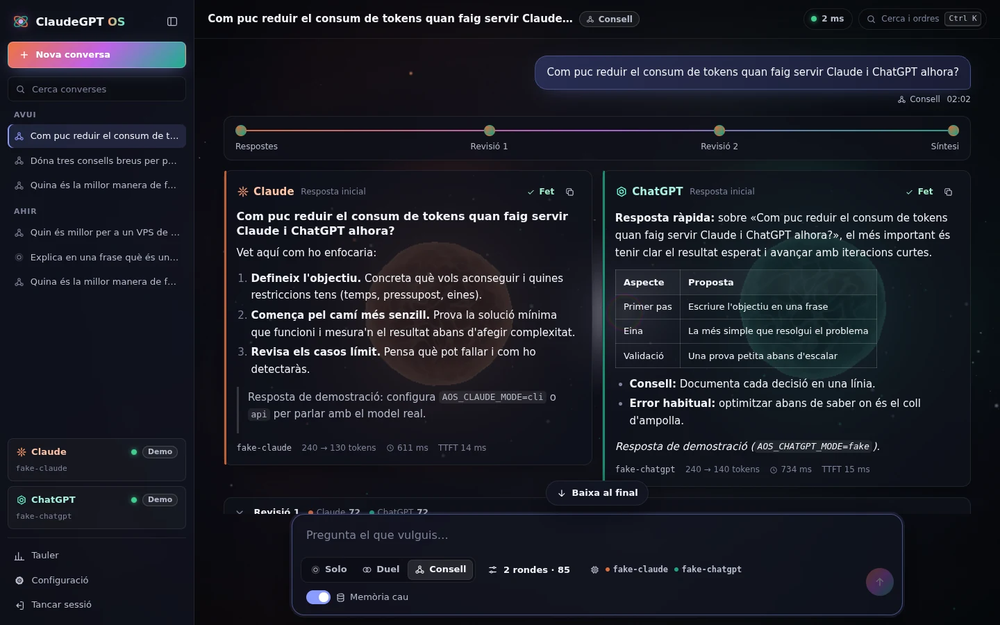

# ClaudeGPT OS

El teu **consell privat de Claude i ChatGPT**. Totes dues IA responen, es critiquen i sintetitzen una resposta millor, gastant els mínims tokens. Tot corre al teu VPS, només hi entres tu i pots fer servir les teves subscripcions (Claude Pro/Max i ChatGPT Plus/Pro) en lloc de claus d'API.



## Què fa

- **Tres modes de treball**
  - **Solo:** respon un agent.
  - **Duel:** responen tots dos en paral·lel.
  - **Consell:** debat amb rondes de revisió i síntesi final.
- **Estalvi de tokens mesurat**
  - Els debats envien només el context mínim.
  - Les rondes s'aturen quan hi ha consens.
  - Les respostes sense canvis no es reescriuen.
  - L'historial es compacta quan creix.
  - Hi ha memòria cau de torns sencers.
  - Cada estalvi es veu al tauler.
- **Subscripcions via les CLI oficials** (Claude Code i Codex), o claus d'API, o un mode de demostració sense cost.
- **Model a triar per a cada agent.** La llista es consulta en directe al proveïdor, així que els models nous hi surten sols. També pots escriure qualsevol identificador.
- **Tokens i euros:**
  - cost de cada resposta;
  - valor equivalent de l'ús de les subscripcions;
  - pressupost mensual i percentatge usat de les finestres de 5 h i setmanal.
- **Interfície molt visual.** Escena 3D amb three.js que reacciona al debat, tauler amb gràfics, paleta d'ordres (Ctrl+K) i disseny adaptat al mòbil.
- **Seguretat per a un sol propietari:**
  - contrasenya argon2id + codi TOTP;
  - sessions al servidor;
  - CSP estricta;
  - contenidors sense root;
  - HTTPS automàtic amb Caddy.
- **Connexió resistent.** Els torns continuen al servidor encara que es talli la connexió, i el navegador els recupera en reconnectar.

## Desplegar al teu VPS

Segueix la guia pas a pas: **[docs/DESPLEGAMENT.md](docs/DESPLEGAMENT.md)**. En resum:

```bash
git clone https://github.com/titoworld/ClaudeGPT-AgenticOS.git && cd ClaudeGPT-AgenticOS
cp .env.example .env && chmod 600 .env && nano .env      # domini i modes
docker compose up -d --build
docker compose exec -it app agentic-os init              # contrasenya i TOTP
docker compose exec -it app claude setup-token           # subscripció de Claude
docker compose exec -it app codex login --device-auth    # subscripció de ChatGPT
docker compose exec app agentic-os doctor                # comprovació final
```

> **Termes d'ús.** El Help Center d'Anthropic (juny 2026) inclou l'ús de `claude -p` en projectes propis com a ús del teu pla. OpenAI recomana claus d'API per a l'automatització, de manera que fer servir la subscripció de ChatGPT a través de Codex és sota la teva responsabilitat. Fes-ne un ús personal, interactiu i moderat. Detalls a l'[ADR 0002](docs/adr/0002-subscripcions-via-cli-oficials.md).

## Provar-ho en local (sense cap cost)

Requisits: [uv](https://docs.astral.sh/uv/getting-started/installation/) i Node.js 22 o superior.

```bash
uv sync
(cd web && npm ci && npm run build)
export AOS_CLAUDE_MODE=fake AOS_CHATGPT_MODE=fake \
       AOS_SECURE_COOKIES=false AOS_PUBLIC_ORIGIN=http://localhost:8000
uv run agentic-os init      # crea la contrasenya i el codi TOTP
uv run agentic-os serve     # obre http://localhost:8000
```

Amb `AOS_CLAUDE_MODE=cli` fa servir la CLI `claude` que tinguis instal·lada i amb sessió iniciada.

## Desenvolupament

| Tasca | Ordre |
| --- | --- |
| Tests del backend | `uv run pytest` |
| Lint i format | `uv run ruff check .` · `uv run ruff format .` |
| Tipus (estricte) | `uv run mypy` |
| Frontend: comprovació, tests, build | `cd web && npm run check && npm test && npm run build` |
| Frontend amb recàrrega | `cd web && npm run dev`, amb el backend a `uv run agentic-os serve --dev` i `AOS_EXTRA_ORIGINS='["http://localhost:5173"]'` |

La CI de GitHub Actions executa les comprovacions de Python (3.12 i 3.13), les del frontend i la construcció de la imatge Docker a cada pull request.

## Estructura

```
.
├── src/agentic_os/
│   ├── providers/      Claude (CLI i API), ChatGPT (Codex app-server i API), fake
│   ├── orchestrator/   motor de torns: solo, duel, consell, compactació, memòria cau
│   ├── storage/        SQLite: converses, ús, estalvis, sessions, configuració
│   ├── security/       contrasenya, TOTP, sessions, límits d'intents
│   ├── server/         FastAPI: REST, WebSocket, capçaleres de seguretat
│   ├── pricing.py      preus per model i cost estimat
│   └── fx.py           canvi USD→EUR del BCE
├── web/                Svelte 5 + three.js (interfície i tauler)
├── deploy/             Caddyfile i script de preparació del VPS
├── docs/               arquitectura, protocol, desplegament i decisions (ADR)
├── Dockerfile, docker-compose.yml
└── CLAUDE.md           instruccions per a les sessions de Claude Code
```

Més informació: [arquitectura](docs/ARQUITECTURA.md) · [protocol client-servidor](docs/PROTOCOL.md) · [decisions](docs/adr/README.md) · [full de ruta](docs/ROADMAP.md).
