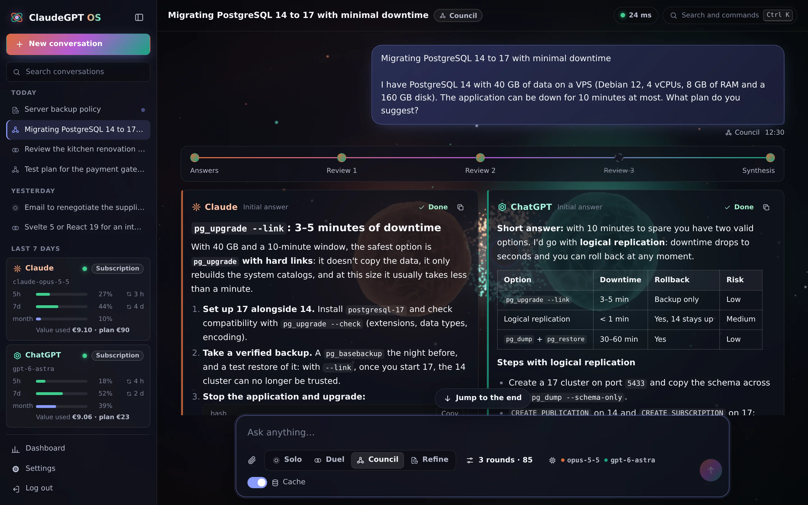
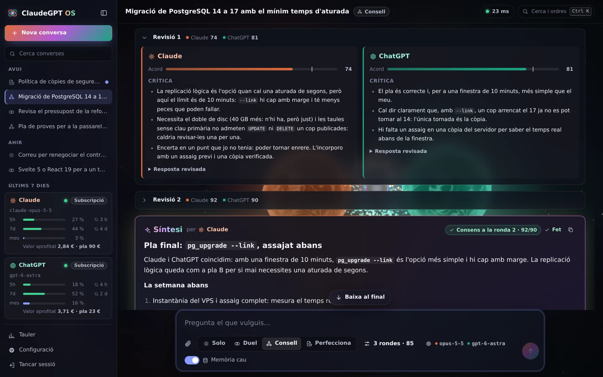
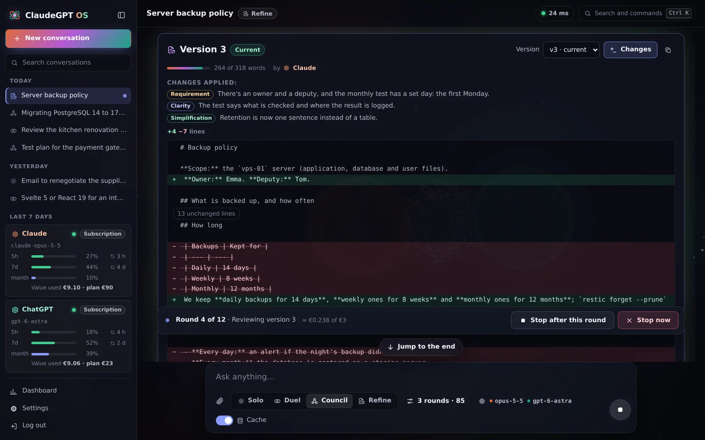
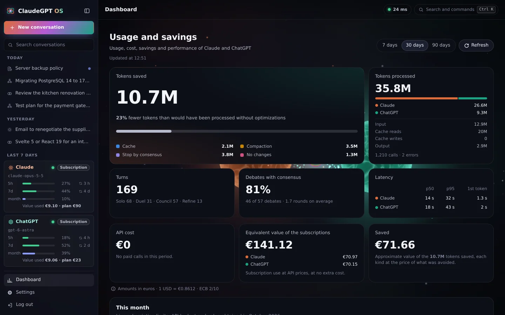
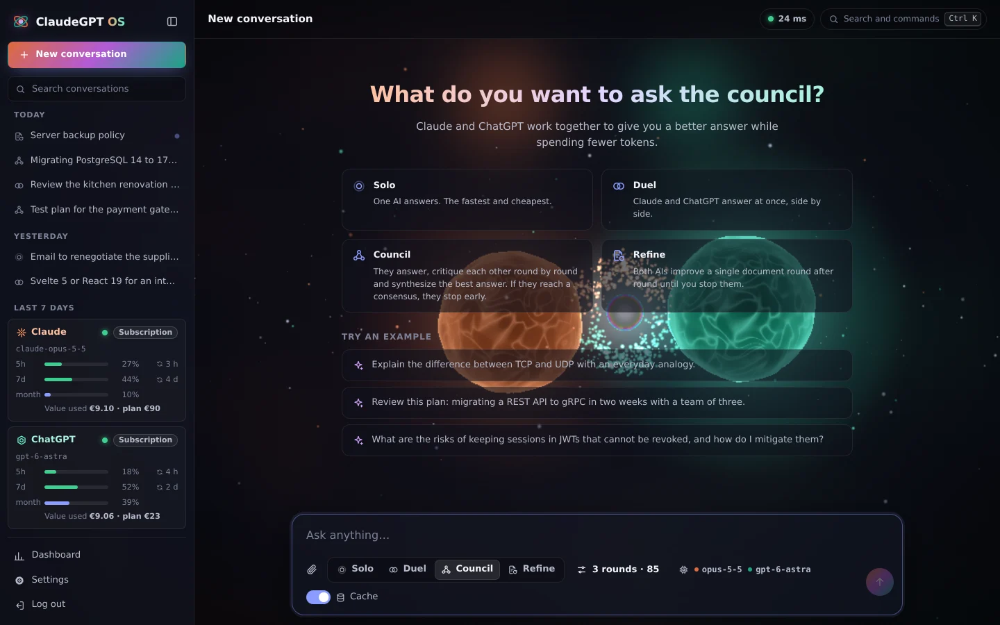

# ClaudeGPT OS

[](https://github.com/titoworld/ClaudeGPT-AgenticOS/actions/workflows/ci.yml)


Your **private council of Claude and ChatGPT**. Both AIs answer, critique each other and synthesize a better answer, spending as few tokens as possible. Everything runs on your VPS, only you can get in, and you can use your subscriptions (Claude Pro/Max and ChatGPT Plus/Pro) instead of API keys.



## What it does

- **Four modes**
  - **Solo:** one agent answers.
  - **Duel:** both answer in parallel.
  - **Council:** a debate with review rounds and a final synthesis.
  - **Refine:** both improve a single document round after round, without bloating it, until you stop them.
- **Measured token savings**
  - Debates send only the minimum context.
  - Rounds stop when there is consensus.
  - Unchanged answers are not rewritten.
  - The history is compacted as it grows.
  - Whole turns are cached.
  - Every saving shows on the dashboard.
- **Attachments in the chat:** images (PNG, JPEG, GIF, WebP), PDFs and text files, with thumbnails as on claude.ai. Pick them, drag them in or paste images; each card shows the estimated tokens before you send. The models get the file itself (ChatGPT with the subscription gets the text of PDFs); in a debate's reviews, PDFs go as text to save tokens (scanned ones go whole), unless you choose otherwise in the settings.
- **PDFs checked by Claude for ChatGPT with the subscription:** Codex cannot open PDFs and reads their text instead; Claude checks that text against the document and passes on the scanned or unreadable pages as it reads them, without any hidden text it finds there. Pages that could not be checked reach ChatGPT as they were extracted, and say so; the card and the models get a warning about the pages the server's analysis finds suspicious.
- **Subscriptions through the official CLIs** (Claude Code and Codex), or API keys, or a free demo mode.
- **Choose each agent's model.** With API keys and with Codex, the list is fetched live from the provider, so new models show up by themselves. With the Claude CLI it is the aliases `opus`, `sonnet`, `haiku` and `fable`, which always point to the latest version. You can also type any model id.
- **Tokens and euros:**
  - the cost of each answer;
  - the equivalent value of your subscriptions' usage;
  - a monthly budget, and the percentage used of the 5-hour and weekly windows.
- **A very visual interface.** A three.js 3D scene that reacts to the debate, a dashboard with charts, a command palette (Ctrl+K) and a layout that works on phones.
- **In English, Spanish and Catalan.** The interface follows your browser's language, or the one you pick on the login screen or in the settings. The server answers in the same language (errors, the agents' status, the models' descriptions), and the AIs answer in the language you write in.
- **Security for a single owner:**
  - argon2id password + TOTP code;
  - server-side sessions;
  - strict CSP;
  - non-root containers;
  - automatic HTTPS with Caddy.
- **A resilient connection.** Turns keep running on the server if the connection drops, and the browser catches up when it reconnects.

## What it looks like

<table>
  <tr>
    <td width="50%" valign="top">
      <a href="docs/img/debate.webp"></a>
      <p><b>Council.</b> Each AI critiques the other's answer and says how far it agrees with it. When both reach the threshold, the rounds stop and one of them writes the synthesis.</p>
    </td>
    <td width="50%" valign="top">
      <a href="docs/img/refine.webp"></a>
      <p><b>Refine.</b> A single document that both AIs improve round after round. Each version says which changes it applies, is compared with the previous one and cannot go over the word limit. You stop it whenever you like.</p>
    </td>
  </tr>
  <tr>
    <td width="50%" valign="top">
      <a href="docs/img/attachments.webp"></a>
      <p><b>Attachments.</b> Images, PDFs and text, with a thumbnail and estimated tokens. ChatGPT with the subscription reads the PDF's text, and Claude checks for ChatGPT the pages that have none (here, the floor plan).</p>
    </td>
    <td width="50%" valign="top">
      <a href="docs/img/dashboard.webp"></a>
      <p><b>Dashboard.</b> The tokens each technique saves, the latency, how often the AIs reach consensus and, in euros at the ECB rate, the subscriptions' value at API prices.</p>
    </td>
  </tr>
  <tr>
    <td width="50%" valign="top">
      <a href="docs/img/start.webp"></a>
      <p><b>Four modes.</b> Solo, Duel, Council and Refine, over a 3D scene that reacts to what the two AIs are doing.</p>
    </td>
    <td width="50%" valign="top">
      <a href="docs/img/mobile.webp"></a>
      <p><b>On the phone.</b> The same app, fitted to a small screen, with the menu showing each subscription's usage.</p>
    </td>
  </tr>
</table>

The screenshots show the real interface with example conversations: the showcase in `web/src/showcase/` makes them, without a backend or any call to the models, and `?lang=` shows it in each language.

## Deploy to your VPS

Follow the step-by-step guide: **[docs/DEPLOYMENT.md](docs/DEPLOYMENT.md)**. In short:

```bash
git clone https://github.com/titoworld/ClaudeGPT-AgenticOS.git /opt/claudegpt && cd /opt/claudegpt
bash deploy/harden.sh                                    # firewall, SSH and Docker
cp .env.example .env && chmod 600 .env && nano .env      # domain and email
docker compose up -d --build
docker compose exec -it app agentic-os init              # password and TOTP
docker compose exec -it app claude setup-token           # put the token in CLAUDE_CODE_OAUTH_TOKEN in .env
docker compose exec -it app codex login --device-auth    # ChatGPT subscription
docker compose up -d --force-recreate app                # applies the token and the Codex session
docker compose exec app agentic-os doctor                # final check
```

`claude setup-token` only prints the token: the app reads it from `.env` (`CLAUDE_CODE_OAUTH_TOKEN=`), which is why the container has to be recreated.

> **Terms of use.** Anthropic's Help Center (June 2026) counts using `claude -p` in your own projects as use of your plan. OpenAI recommends API keys for automation, so using your ChatGPT subscription through Codex is your own responsibility. Keep your use personal, interactive and moderate. Details in [ADR 0002](docs/adr/0002-subscriptions-via-official-clis.md).

## Try it locally (at no cost)

Requirements: [uv](https://docs.astral.sh/uv/getting-started/installation/) and Node.js 22 or later.

```bash
uv sync
(cd web && npm ci && npm run build)
export AOS_CLAUDE_MODE=fake AOS_CHATGPT_MODE=fake \
       AOS_SECURE_COOKIES=false AOS_PUBLIC_ORIGIN=http://localhost:8000
uv run agentic-os init      # creates the password and the TOTP code
uv run agentic-os serve     # then open http://localhost:8000
```

With `AOS_CLAUDE_MODE=cli` it uses the `claude` CLI you have installed and logged in.

## Development

| Task | Command |
| --- | --- |
| Backend tests | `uv run pytest` |
| Lint and format | `uv run ruff check .` · `uv run ruff format .` |
| Types (strict) | `uv run mypy` |
| Frontend: check, tests, build | `cd web && npm run check && npm test && npm run build` |
| Frontend with hot reload | `cd web && npm run dev`, with the backend on `uv run agentic-os serve --dev` and `AOS_EXTRA_ORIGINS='["http://localhost:5173"]'` |
| Showcase with example conversations, without a backend | `cd web && npm run dev` and open `http://localhost:5173/src/showcase/index.html?shot=council` |

The frontend tests (vitest) cover the logic and also the components, which are mounted in jsdom with `web/src/lib/test-render.ts`.

The backend tests also run on macOS (those of the deployment scripts only run on Linux): process state is checked with `tests/portability.py`, never by reading `/proc`. Also, `tests/test_docs.py` checks that the documentation says what the code does: the limits, the `AOS_*` variables and the files it names.

The interface's texts live in `web/src/lib/i18n/areas/` and the server's in `src/agentic_os/locales/`, in English, Spanish and Catalan ([ADR 0011](docs/adr/0011-internationalization.md)). The tests check the Catalan texts by default, and the i18n tests check the other two languages.

The showcase (`web/src/showcase/`) mounts the whole app against a fake server with example conversations: a Council, a Duel over a PDF and a Refine turn in progress. `?shot=` picks the view: `start` (a new conversation), `council` (the Council), `attachments` (the attachments), `refine` (Refine), `dashboard` (the dashboard) or `settings` (the settings); `?lang=` picks the language (`en`, `es` or `ca`). Use it to review the interface without a backend and to retake this README's screenshots.

GitHub Actions CI runs the Python checks (3.12 and 3.13), the frontend checks and the Docker image build on every pull request.

## Structure

```
.
├── src/agentic_os/
│   ├── providers/      Claude (CLI and API), ChatGPT (Codex app-server and API), fake
│   ├── orchestrator/   turn engine: solo, duel, council, refine, compaction, cache
│   ├── storage/        SQLite: conversations, attachments, usage, savings, sessions, settings
│   ├── security/       password, TOTP, sessions, login attempt limits
│   ├── server/         FastAPI: REST, WebSocket, security headers
│   ├── locales/        the server's texts in English, Spanish and Catalan
│   ├── attachments.py  attachments: limits, type from the content, PDF text
│   ├── pricing.py      prices per model and estimated cost
│   └── fx.py           the ECB's USD→EUR rate
├── web/                Svelte 5 + three.js (interface, dashboard and the screenshots' showcase)
├── deploy/             Caddyfile, VPS setup, and backup and restore scripts
├── docs/               architecture, protocol, deployment and decisions (ADRs)
├── Dockerfile, docker-compose.yml
└── CLAUDE.md           instructions for Claude Code sessions
```

More: [architecture](docs/ARCHITECTURE.md) · [client-server protocol](docs/PROTOCOL.md) · [decisions](docs/adr/README.md) · [roadmap](docs/ROADMAP.md).
