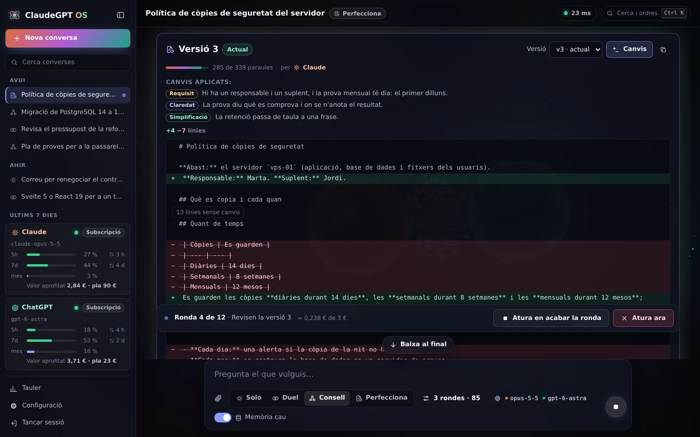
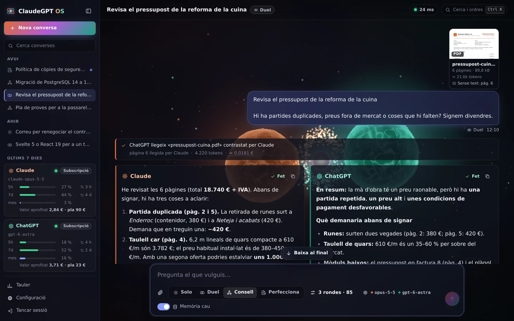
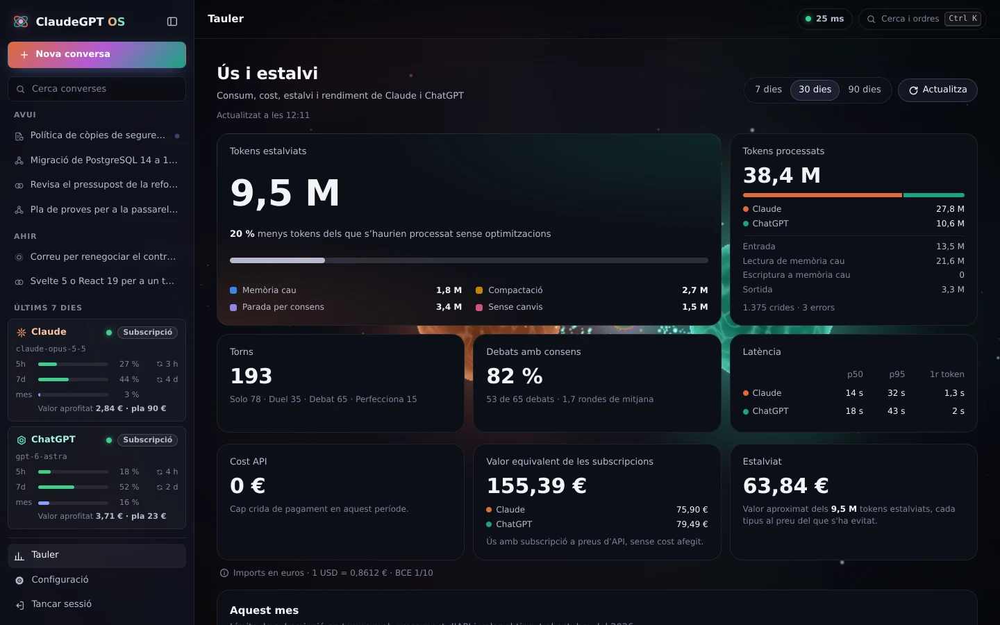
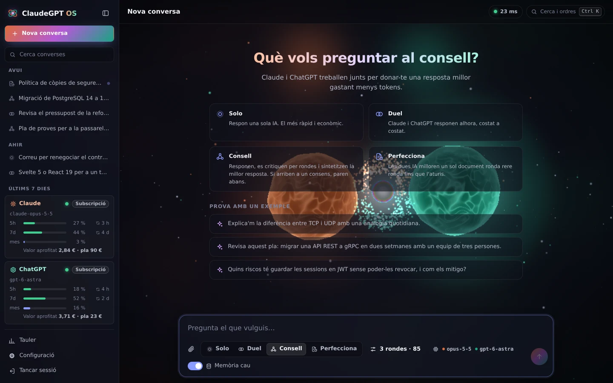
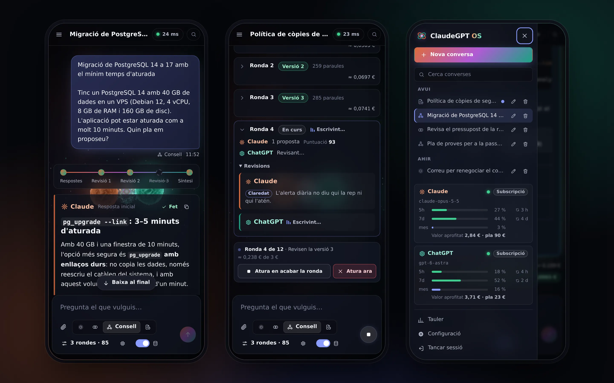

# ClaudeGPT OS

[](https://github.com/titoworld/ClaudeGPT-AgenticOS/actions/workflows/ci.yml)


El teu **consell privat de Claude i ChatGPT**. Totes dues IA responen, es critiquen i sintetitzen una resposta millor, gastant els mínims tokens. Tot corre al teu VPS, només hi entres tu i pots fer servir les teves subscripcions (Claude Pro/Max i ChatGPT Plus/Pro) en lloc de claus d'API.


## Què fa

- **Quatre modes de treball**
  - **Solo:** respon un agent.
  - **Duel:** responen tots dos en paral·lel.
  - **Consell:** debat amb rondes de revisió i síntesi final.
  - **Perfecciona:** milloren un sol document ronda rere ronda, sense inflar-lo, fins que l'atures.
- **Estalvi de tokens mesurat**
  - Els debats envien només el context mínim.
  - Les rondes s'aturen quan hi ha consens.
  - Les respostes sense canvis no es reescriuen.
  - L'historial es compacta quan creix.
  - Hi ha memòria cau de torns sencers.
  - Cada estalvi es veu al tauler.
- **Adjunts al xat:** imatges (PNG, JPEG, GIF, WebP), PDF i fitxers de text, amb miniatures com a claude.ai. Tria'ls, arrossega'ls o enganxa les imatges; cada targeta mostra els tokens estimats abans d'enviar. Els models reben el fitxer mateix (ChatGPT amb la subscripció, el text dels PDF); a les revisions d'un debat, els PDF hi van com a text per estalviar tokens (els escanejats, sencers), si no tries el contrari a la configuració.
- **PDF contrastats per Claude per a ChatGPT amb la subscripció:** Codex no pot obrir cap PDF i en llegeix el text; Claude el contrasta amb el document i li passa les pàgines escanejades o il·legibles tal com les llegeix, sense el text amagat que hi trobi. Les pàgines que no s'han pogut contrastar li arriben tal com s'han extret i ho diuen, i la targeta i els models reben l'avís de les que l'anàlisi del servidor troba sospitoses.
- **Subscripcions via les CLI oficials** (Claude Code i Codex), o claus d'API, o un mode de demostració sense cost.
- **Model a triar per a cada agent.** Amb claus d'API i amb Codex, la llista es demana en directe al proveïdor, així que els models nous hi surten sols. Amb la CLI de Claude són els àlies `opus`, `sonnet`, `haiku` i `fable`, que sempre apunten a l'última versió. També pots escriure qualsevol identificador.
- **Tokens i euros:**
  - cost de cada resposta;
  - valor equivalent de l'ús de les subscripcions;
  - pressupost mensual i percentatge usat de les finestres de 5 h i setmanal.
- **Interfície molt visual.** Escena 3D amb three.js que reacciona al debat, tauler amb gràfics, paleta d'ordres (Ctrl+K) i disseny adaptat al mòbil.
- **Seguretat per a un sol propietari:**
  - contrasenya argon2id + codi TOTP;
  - sessions al servidor;
  - CSP estricta;
  - contenidors sense root;
  - HTTPS automàtic amb Caddy.
- **Connexió resistent.** Els torns continuen al servidor encara que es talli la connexió, i el navegador els recupera en reconnectar.

## Com es veu

<table>
  <tr>
    <td width="50%" valign="top">
      <a href="docs/img/debat.webp"></a>
      <p><b>Consell.</b> Cada IA critica la resposta de l'altra i diu fins a quin punt hi està d'acord. Quan totes dues arriben al llindar, les rondes s'aturen i una escriu la síntesi.</p>
    </td>
    <td width="50%" valign="top">
      <a href="docs/img/perfecciona.webp"></a>
      <p><b>Perfecciona.</b> Un sol document que les dues IA milloren ronda rere ronda. Cada versió diu quins canvis aplica, es compara amb l'anterior i no pot passar del límit de paraules. L'atures quan vulguis.</p>
    </td>
  </tr>
  <tr>
    <td width="50%" valign="top">
      <a href="docs/img/adjunts.webp"></a>
      <p><b>Adjunts.</b> Imatges, PDF i text, amb miniatura i tokens estimats. ChatGPT amb la subscripció llegeix el text del PDF, i Claude li contrasta les pàgines que no en tenen (aquí, el plànol).</p>
    </td>
    <td width="50%" valign="top">
      <a href="docs/img/tauler.webp"></a>
      <p><b>Tauler.</b> Els tokens que estalvia cada tècnica, la latència, els consensos i, en euros amb el canvi del BCE, el valor de les subscripcions a preus d'API.</p>
    </td>
  </tr>
  <tr>
    <td width="50%" valign="top">
      <a href="docs/img/inici.webp"></a>
      <p><b>Quatre modes.</b> Solo, Duel, Consell i Perfecciona, amb una escena 3D de fons que reacciona al que fan les dues IA.</p>
    </td>
    <td width="50%" valign="top">
      <a href="docs/img/mobil.webp"></a>
      <p><b>Al mòbil.</b> La mateixa aplicació adaptada a la pantalla petita, amb el menú que mostra l'ús de cada subscripció.</p>
    </td>
  </tr>
</table>

Les captures són de la interfície real amb converses d'exemple: les genera l'aparador de `web/src/showcase/`, sense backend ni cap crida als models.

## Desplegar al teu VPS

Segueix la guia pas a pas: **[docs/DEPLOYMENT.md](docs/DEPLOYMENT.md)**. En resum:

```bash
git clone https://github.com/titoworld/ClaudeGPT-AgenticOS.git /opt/claudegpt && cd /opt/claudegpt
bash deploy/harden.sh                                    # tallafoc, SSH i Docker
cp .env.example .env && chmod 600 .env && nano .env      # domini i correu
docker compose up -d --build
docker compose exec -it app agentic-os init              # contrasenya i TOTP
docker compose exec -it app claude setup-token           # posa el token a CLAUDE_CODE_OAUTH_TOKEN de .env
docker compose exec -it app codex login --device-auth    # subscripció de ChatGPT
docker compose up -d --force-recreate app                # aplica el token i la sessió de Codex
docker compose exec app agentic-os doctor                # comprovació final
```

`claude setup-token` només mostra el token: l'aplicació el llegeix de `.env` (`CLAUDE_CODE_OAUTH_TOKEN=`), i per això cal tornar a crear el contenidor.

> **Termes d'ús.** El Help Center d'Anthropic (juny 2026) inclou l'ús de `claude -p` en projectes propis com a ús del teu pla. OpenAI recomana claus d'API per a l'automatització, de manera que fer servir la subscripció de ChatGPT a través de Codex és sota la teva responsabilitat. Fes-ne un ús personal, interactiu i moderat. Detalls a l'[ADR 0002](docs/adr/0002-subscriptions-via-official-clis.md).

## Provar-ho en local (sense cap cost)

Requisits: [uv](https://docs.astral.sh/uv/getting-started/installation/) i Node.js 22 o superior.

```bash
uv sync
(cd web && npm ci && npm run build)
export AOS_CLAUDE_MODE=fake AOS_CHATGPT_MODE=fake \
       AOS_SECURE_COOKIES=false AOS_PUBLIC_ORIGIN=http://localhost:8000
uv run agentic-os init      # crea la contrasenya i el codi TOTP
uv run agentic-os serve     # obre http://localhost:8000
```

Amb `AOS_CLAUDE_MODE=cli` fa servir la CLI `claude` que tinguis instal·lada i amb sessió iniciada.

## Desenvolupament

| Tasca | Ordre |
| --- | --- |
| Tests del backend | `uv run pytest` |
| Lint i format | `uv run ruff check .` · `uv run ruff format .` |
| Tipus (estricte) | `uv run mypy` |
| Frontend: comprovació, tests, build | `cd web && npm run check && npm test && npm run build` |
| Frontend amb recàrrega | `cd web && npm run dev`, amb el backend a `uv run agentic-os serve --dev` i `AOS_EXTRA_ORIGINS='["http://localhost:5173"]'` |
| Aparador amb converses d'exemple, sense backend | `cd web && npm run dev` i obre `http://localhost:5173/src/showcase/index.html?shot=consell` |

Els tests del frontend (vitest) cobreixen la lògica i també els components, que es munten a jsdom amb `web/src/lib/test-render.ts`.

Els tests del backend també funcionen a macOS (els dels scripts de desplegament només corren a Linux): l'estat dels processos es comprova amb `tests/portability.py`, mai llegint `/proc`. A més, `tests/test_docs.py` comprova que la documentació diu el que fa el codi: els límits, les variables `AOS_*` i els fitxers que cita.

L'aparador (`web/src/showcase/`) munta tota l'aplicació contra un servidor simulat amb converses d'exemple: un Consell, un Duel amb un PDF i un torn de Perfecciona en curs. `?shot=` tria la vista (`inici`, `consell`, `adjunts`, `perfecciona`, `tauler` o `configuracio`). Serveix per revisar la interfície sense backend i per refer les captures d'aquest README.

La CI de GitHub Actions executa les comprovacions de Python (3.12 i 3.13), les del frontend i la construcció de la imatge Docker a cada pull request.

## Estructura

```
.
├── src/agentic_os/
│   ├── providers/      Claude (CLI i API), ChatGPT (Codex app-server i API), fake
│   ├── orchestrator/   motor de torns: solo, duel, consell, perfecciona, compactació, memòria cau
│   ├── storage/        SQLite: converses, adjunts, ús, estalvis, sessions, configuració
│   ├── security/       contrasenya, TOTP, sessions, límits d'intents
│   ├── server/         FastAPI: REST, WebSocket, capçaleres de seguretat
│   ├── attachments.py  adjunts: límits, tipus pel contingut, text dels PDF
│   ├── pricing.py      preus per model i cost estimat
│   └── fx.py           canvi USD→EUR del BCE
├── web/                Svelte 5 + three.js (interfície, tauler i l'aparador de les captures)
├── deploy/             Caddyfile, preparació del VPS i scripts de còpia i restauració
├── docs/               arquitectura, protocol, desplegament i decisions (ADR)
├── Dockerfile, docker-compose.yml
└── CLAUDE.md           instruccions per a les sessions de Claude Code
```

Més informació: [arquitectura](docs/ARCHITECTURE.md) · [protocol client-servidor](docs/PROTOCOL.md) · [decisions](docs/adr/README.md) · [full de ruta](docs/ROADMAP.md).
